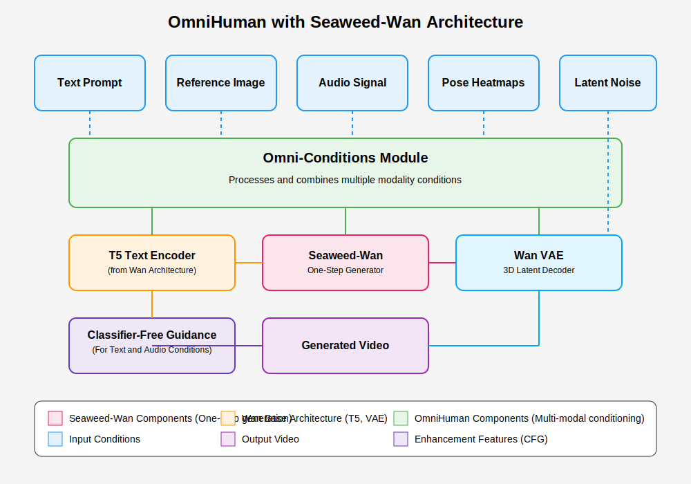

# OmniHuman-Seaweed Implementation Guide

download this
https://github.com/facebookresearch/sapiens

update the omni_config.yaml with respective sapiens paths

This guide outlines the integration of OmniHuman's multi-modal conditioning architecture with Seaweed-Wan's one-step video generation capability.

## 1. Architecture Overview

The integrated OmniHuman-Seaweed model combines two key innovations:

1. **Seaweed APT on Wan Architecture**: Enables one-step video generation using adversarial post-training.
2. **OmniHuman Conditioning System**: Provides multi-modal control through text, audio, pose, and reference images.

## 2. Key Components

### 2.1 Base Models

- **Wan Architecture**: Provides the foundation with high-quality video generation capabilities.
  - T5 Text Encoder for processing text prompts
  - 3D VAE for encoding/decoding video frames to/from latent space
  - Transformer backbone for denoising

- **Seaweed APT**: Delivers one-step generation through:
  - Consistency distillation for initialization
  - Adversarial post-training for quality improvement
  - Classifier-free guidance for controlled generation

### 2.2 OmniHuman Extensions

- **Omni-Conditions Module**: Processes multiple modalities:
  - Audio Processor: Handles audio features for lip syncing and timing
  - Pose Guider: Processes pose heatmaps for motion control
  - Reference Processing: Maintains appearance consistency

- **Condition Fusion**: Combines multiple conditions effectively:
  - Temporal embeddings for sequential context
  - Learnable projections for condition weighting
  - Condition weighting based on strength (pose > audio > text)

## 3. Implementation Steps

### 3.1 Prerequisite Models

1. **Obtain Wan Pre-trained Model**:
   - Download Wan T2V-14B checkpoint from official sources
   - Prepare T5 encoder and VAE components

2. **Create Seaweed-Wan Generator**:
   - Implement consistency distillation training
   - Train the adversarial post-training setup
   - Save the one-step generator checkpoint

### 3.2 Building the Integrated Model

1. **Implement OmniHuman Conditioning**:
   - Create condition processing modules for each modality
   - Ensure compatible dimensions with Wan architecture
   - Implement condition fusion mechanisms

2. **Connect to Seaweed-Wan Generator**:
   - Replace the original denoising function with Seaweed-Wan one-step generator
   - Modify the inference process to handle multiple conditions
   - Implement classifier-free guidance for text and audio

3. **Implement Training Pipeline**:
   - Adapt the three-stage training strategy from OmniHuman
   - Adjust condition ratios for balanced multi-modal learning
   - Implement data loading for mixed condition datasets

## 4. Training Strategy

Follow the OmniHuman three-stage training approach:

### Stage 1: Text and Reference Only
- Train only with text prompts and reference images
- Ratio: 100% text, 100% reference
- Purpose: Learn basic generation capabilities

### Stage 2: Add Audio Conditions
- Include audio features for timing and lip syncing
- Ratio: 100% text, 100% reference, 50% audio
- Purpose: Learn audio-driven motion

### Stage 3: Add Pose Conditions
- Include pose heatmaps for precise motion control
- Ratio: 100% text, 100% reference, 50% audio, 25% pose
- Purpose: Learn accurate body movements

## 5. Inference Process

1. **Process Input Conditions**:
   - Encode text through T5 encoder
   - Process audio through AudioProcessor
   - Convert pose through PoseGuider
   - Encode reference image through VAE

2. **Generate Latent Noise**:
   - Create random noise matching target dimensions
   - Use seed for reproducibility

3. **Apply One-Step Generation**:
   - Feed conditions and noise to Seaweed-Wan generator
   - Apply classifier-free guidance if needed
   - Decode latents to pixel space with VAE

4. **Post-Processing**:
   - Apply any necessary video enhancement
   - Ensure temporal coherence

## 6. Optimization Considerations

1. **Memory Management**:
   - Offload text encoder to CPU when not in use
   - Use gradient checkpointing during training
   - Leverage mixed precision (BF16/FP16)

2. **Speed Optimizations**:
   - Parallelize processing of different conditions
   - Pre-compute and cache reference image embeddings
   - Use efficient tensor operations for condition fusion

3. **Quality Improvements**:
   - Apply CFG annealing to reduce artifacts while maintaining expressiveness
   - Adjust condition weights for the best quality-control balance
   - Implement temporal coherence mechanisms for long videos

## 7. Evaluation Metrics

Use the following metrics to evaluate your implementation:

1. **Visual Quality**:
   - FID (Fréchet Inception Distance)
   - IQA (Image Quality Assessment)

2. **Motion Quality**:
   - Sync-C (Lip Sync Confidence)
   - HKC/HKV (Hand Keypoint accuracy)
   - FVD (Fréchet Video Distance)

3. **Identity Preservation**:
   - ASE (Average Subject Embeddings)

## 8. Troubleshooting

- **Mode Collapse**: Increase batch size or adjust R1 regularization
- **Poor Lip Sync**: Increase audio condition weight or adjust fusion
- **Identity Drift**: Enhance reference processing or adjust CFG scale
- **Unstable Training**: Lower learning rate or implement gradient clipping

## 9. Next Steps

After implementing the basic integration:

1. **Fine-tune for Specific Use Cases**:
   - Portrait generation (talking head)
   - Full-body movement
   - Special effects or stylization

2. **Extend to Longer Videos**:
   - Implement sliding window approach
   - Develop conditional chaining for continuity

3. **Add More Control Options**:
   - Camera movement control
   - Background control
   - Style transfer capabilities

By following this guide, you'll successfully integrate OmniHuman's multi-modal conditioning with Seaweed-Wan's efficient one-step generation, creating a powerful and flexible human video generation system.
